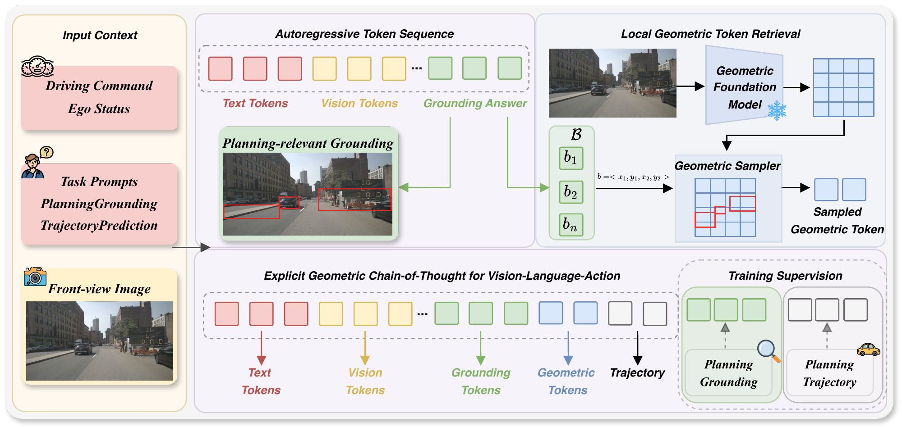

<div align="center">

<h1>Explicit Geometric Chain-of-Thought for Vision-Language-Action in Autonomous Driving</h1>

<p>
  Xingtai Gui<sup>1</sup>, Yucheng Zhou<sup>1</sup>, Dongqian Guo<sup>1</sup>,
  Jiahao Gong<sup>2</sup>, Feiyang Tan<sup>2</sup>, Jianbing Shen<sup>1,*</sup>
</p>

<p>
  <sup>1</sup>SKL-IOTSC, Department of AI, University of Macau<br>
  <sup>2</sup>Afari Intelligent Drive<br>
  <sup>*</sup>Corresponding author
</p>

<p>
  <a href="https://arxiv.org/abs/2610.10390"></a>
  <a href="https://huggingface.co/tabguigui/geocotdrive_nuscenes"></a>
  <a href="https://huggingface.co/tabguigui/geocotdrive_stage2"></a>
</p>

</div>

## Abstract

Vision-language-action (VLA) models have emerged as a promising paradigm for autonomous driving. However, existing VLA models still suffer from a fundamental mismatch: driving actions require precise 3D geometric cues, while visual-language understanding and reasoning are largely conducted in a 2D semantic space. In this paper, we propose GeoCoTDrive, an explicit geometric chain-of-thought framework that grounds geometry in a planning-oriented manner. GeoCoTDrive follows a “think with 2D first, drive with dedicated 3D priors” paradigm. It first grounds 2D regions corresponding to decision-critical cues, and then retrieves localized 3D priors by sampling features from a geometric foundation model within the grounded regions. These localized geometric features are interleaved into the autoregressive context to support the trajectory generation. To supervise this process, we introduce planning-relevant grounding, a new region-level grounding task that focuses on local spatial cues directly affecting ego planning decisions, and construct the PlanningGrounding dataset to endow VLAs with planning-oriented grounding capability. Experiments across multiple end-to-end autonomous driving benchmarks show that GeoCoTDrive consistently improves safety-critical planning performance, demonstrating the effectiveness of the explicit geometric chain-of-thought process for VLA-based planning.

<div align="center">
<a href="./assets/main_camera.pdf">
  
</a>
</div>

---

## News

- **[2026.10.8]** GeoCoTDrive code and checkpoints release.
- **[2026.10.8]** GeoCoTDrive [paper](https://arxiv.org/abs/2610.10390) released on arXiv.

## TODO

- Release the PlanningGrounding dataset.
- Release training scripts.

## Table of Contents

- [Abstract](#abstract)
- [News](#news)
- [TODO](#todo)
- [Environment Setup](#environment-setup)
- [Checkpoint](#checkpoint)
- [Quick Evaluation](#quick-evaluation)
- [Visualize GeoCoTDrive](#visualize-geocotdrive)
- [Acknowledgement](#acknowledgement)
- [Related Work](#related-work)
- [Citation](#citation)

---

## Environment Setup

Choose the environment guide for the benchmark you want to run:

- [nuScenes environment setup](./geocotdrive_nuscenes/docs/setup.md)
- [NAVSIM environment setup](./geocotdrive_navsim/docs/setup.md)

Data sources:

- nuScenes (`data/nuscenes/`): [OmniDrive](https://github.com/NVlabs/OmniDrive).
- NAVSIM (`data/navsim/`): [RecogDrive](https://github.com/xiaomi-research/recogdrive).

The additional PlanningGrounding dataset will be released later.

---

## Checkpoint

| Benchmark | Hugging Face checkpoint |
| --- | --- |
| nuScenes | [tabguigui/geocotdrive_nuscenes](https://huggingface.co/tabguigui/geocotdrive_nuscenes) |
| NAVSIM | [tabguigui/geocotdrive_stage2](https://huggingface.co/tabguigui/geocotdrive_stage2) |

## Quick Evaluation

### nuScenes

```bash
CKPT="$PWD/ckpts/geocotdrive_nuscenes/geocotdrive_nus.pth" bash geocotdrive_nuscenes/scripts/eval_geocotdrive.sh
```

### NAVSIM

```bash
CKPT="$PWD/ckpts/geocotdrive_navsim_stage2" bash geocotdrive_navsim/scripts/evaluation/eval.sh
```

## Visualize GeoCoTDrive

```bash
PRED_PATH=../results/geocotdrive SAVE_PATH=../results/visual_geocotdrive bash geocotdrive_nuscenes/scripts/eval_planning.sh
```

## Acknowledgement

GeoCoTDrive benefits from the following open-source projects:

- [OmniDrive](https://github.com/NVlabs/OmniDrive)
- [Depth Anything 3](https://github.com/ByteDance-Seed/Depth-Anything-3)
- [Orion](https://github.com/xiaomi-mlab/Orion)
- [ms-swift](https://github.com/modelscope/ms-swift)
- [SpaceDrive](https://github.com/zhenghao2519/SpaceDrive)
- [RecogDrive](https://github.com/xiaomi-research/recogdrive)

We thank their authors and contributors for sharing their work.

## Related Work

Other open-source end-to-end autonomous driving projects from SKL-IOTSC, University of Macau:

- [WorldDrive](https://github.com/TabGuigui/WorldDrive) unifies vision and motion representations to connect driving scene generation with trajectory planning.
- [TrajDiff](https://github.com/TabGuigui/TrajDiff) uses trajectory-oriented BEV features and diffusion to plan without perception annotations.

## Citation

If GeoCoTDrive is helpful for your research, please consider citing it:

```bibtex
@misc{gui2026explicitgeometricchainofthoughtvisionlanguageaction,
  title={Explicit Geometric Chain-of-Thought for Vision-Language-Action in Autonomous Driving},
  author={Xingtai Gui and Yucheng Zhou and Dongqian Guo and Jiahao Gong and Feiyang Tan and Jianbing Shen},
  year={2026},
  eprint={2610.10390},
  archivePrefix={arXiv},
  primaryClass={cs.CV},
  url={https://arxiv.org/abs/2610.10390},
}
```
